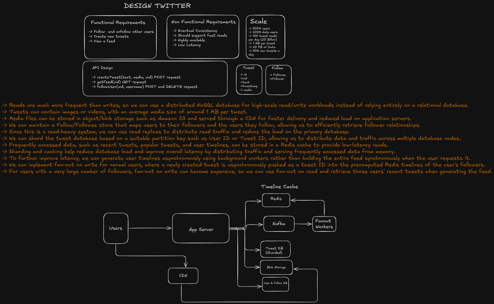
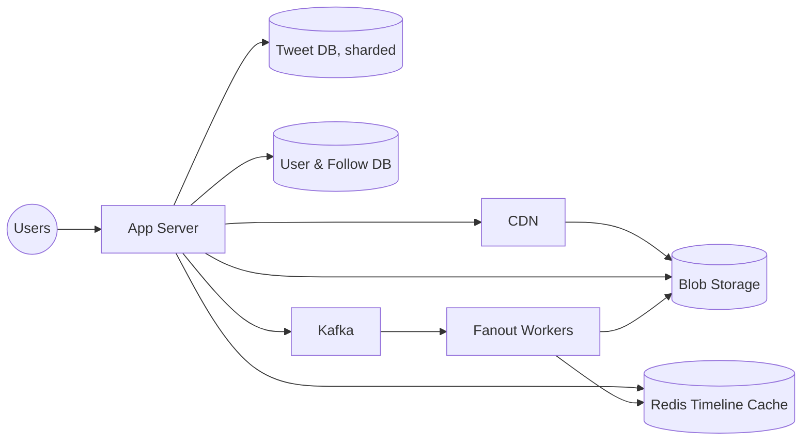

# Design Twitter

A system design write-up for a Twitter-like social feed service — users follow/unfollow each other, post tweets, and view a home feed made up of tweets from the people they follow.

This is a design-only exercise (no implementation code in this folder). The original whiteboard is in [`design_twitter.excalidraw`](./design_twitter.excalidraw); a rendered snapshot is below.



## Requirements

### Functional

- **Follow / unfollow** other users.
- **Create new tweets** (text + optional media).
- **View a feed** made up of tweets from followed users.

### Non-functional

- **Eventual consistency** is acceptable — a follower's feed doesn't need to reflect a new tweet instantly.
- **Fast reads** — viewing a feed is the dominant, latency-sensitive operation.
- **Highly available.**
- **Low latency.**

### Scale

| Metric | Value |
|---|---|
| Total users | 500 million |
| Daily active users | 200 million |
| Tweet reads per day | 100 billion |
| New tweets per day | 50 million |
| Average tweet size (with media) | 1 MB |
| Total data | 20 PB |

Reads (100B/day) dwarf writes (50M/day) by more than three orders of magnitude — this ratio is what drives nearly every decision below: precomputing feeds, caching aggressively, and choosing storage/replication strategies optimized for read throughput over write simplicity.

## Core Entities

**Tweet**

| Field | Type |
|---|---|
| `id` | string |
| `uid` | string |
| `text` | string |
| `timestamp` | date |
| `media` | string (blob storage reference) |

**Follow**

| Field | Type |
|---|---|
| `followee` | string |
| `follower` | string |

## API Design

```
POST   /tweets            createTweet(text, media, uid)
GET    /feed               getFeed(uid)
POST   /follow             followUser(uid, username)
DELETE /follow             followUser(uid, username)
```

## High-Level Design



- **Tweet DB is a sharded NoSQL store**, partitioned by a key like User ID or Tweet ID, chosen because reads massively outnumber writes at this scale — a distributed NoSQL store handles that read/write pattern better than leaning entirely on a single relational database.
- **Media is offloaded to blob storage (e.g. S3) and served via a CDN**, rather than through the application servers — this keeps large payloads (~1 MB/tweet) off the hot request path and off the DB entirely.
- **User & Follow DB** maintains the follow/follower graph — who each user follows, and who follows them — so both directions of the relationship can be looked up efficiently (needed for both "who do I follow" on write and "who are my followers" on fan-out).
- **Read replicas** distribute read traffic off the primary DB, matching the read-heavy access pattern.
- **Redis timeline cache** stores each user's precomputed feed (a list of tweet IDs) for low-latency reads — `getFeed` becomes a cache read instead of a live query across everyone the user follows.
- **Kafka + fan-out workers** decouple tweet creation from timeline generation: `createTweet` publishes to Kafka and returns immediately, and workers asynchronously push the new tweet ID into the precomputed Redis timelines of the author's followers. This keeps the write path fast and matches the eventual-consistency requirement — a follower's feed updates shortly after, not synchronously.

## Design Deep Dives

### Fan-out on write vs. fan-out on read (the celebrity problem)

- **Fan-out on write** (used for most users): when a user tweets, a fan-out worker pushes the new tweet ID into the precomputed Redis timeline of *every one of their followers*. This makes `getFeed` cheap — it's just reading one list — at the cost of a write amplifying into many timeline updates.
- **Fan-out on write breaks down for celebrities.** A user with tens of millions of followers would mean a single tweet triggers tens of millions of timeline writes — far too expensive and slow to do synchronously or even asynchronously at that fan-out ratio.
- **Fan-out on read for high-follower accounts:** past a follower-count threshold, a user's tweets are *not* pushed to followers' precomputed timelines. Instead, their recent tweets are fetched live and merged in at feed-read time.
- **Merging at read time:** `getFeed(uid)` reads the user's precomputed Redis timeline (covering everyone they follow via fan-out-on-write) *and separately* fetches recent tweets from any celebrity accounts they follow (fan-out-on-read), then merges both sets by timestamp before returning the feed. This hybrid approach is what makes the design scale for both the average user and accounts with an outsized follower count.

### Why Kafka between the app server and fan-out workers

Publishing the new-tweet event to Kafka rather than calling fan-out workers directly decouples tweet creation from timeline propagation: the app server's write path only has to enqueue an event and return, fan-out workers can scale and retry independently of request traffic, and a burst of tweets (or a temporarily slow worker pool) doesn't back up tweet creation itself — it just adds a small, bounded delay before followers see it, which the eventual-consistency requirement explicitly allows for.

### Tweet ID generation

Tweet IDs need to be unique across a distributed, sharded write path and ideally roughly time-ordered (so a feed can be sorted/paginated by ID without a separate timestamp lookup). A Snowflake-style generator — see [`unique-id-generator`](../unique-id-generator/README.md) — is a natural fit here: coordination-free ID generation across app server instances, with IDs that sort roughly by creation time.

### Sharding and caching

Sharding the Tweet DB (by User ID or Tweet ID) and caching hot data in Redis — recent tweets, popular tweets, precomputed user timelines — both serve the same goal from different angles: sharding distributes load and storage across nodes, while caching serves the most frequently accessed data straight from memory instead of hitting the DB at all. Together they're what makes ~100B reads/day tractable on top of a 20 PB dataset.
