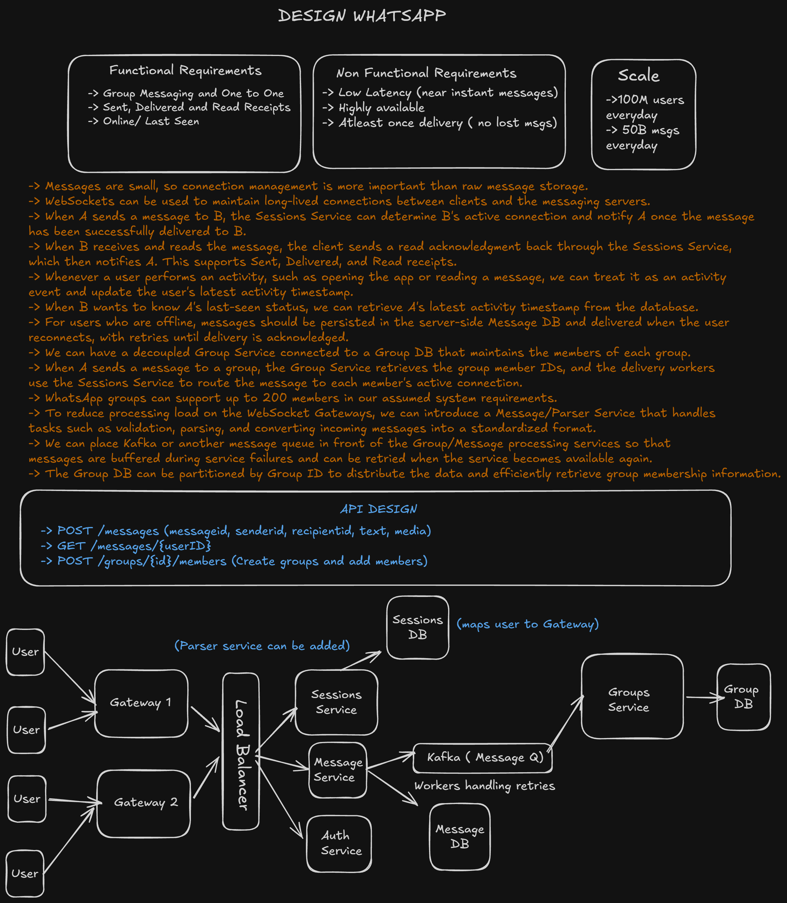
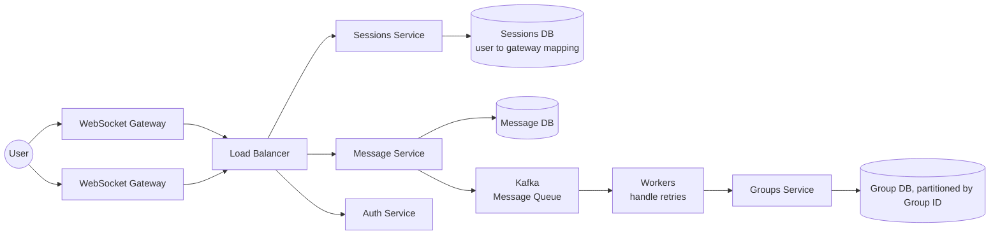

# Design WhatsApp

A system design write-up for a WhatsApp-like real-time messaging service — one-to-one and group messaging with delivery receipts and presence, built around long-lived connections rather than a traditional request/response API.

This is a design-only exercise (no implementation code in this folder). The original whiteboard is in [`design_whatsapp.excalidraw`](./design_whatsapp.excalidraw); a rendered snapshot is below.



## Requirements

### Functional

- **One-to-one and group messaging.**
- **Sent, delivered, and read receipts.**
- **Online / last-seen status.**

### Non-functional

- **Low latency** — messages should arrive near-instantly.
- **Highly available.**
- **At-least-once delivery** — no messages should be silently lost.

### Scale

| Metric | Value |
|---|---|
| Daily active users | 100 million |
| Messages per day | 50 billion |

**Key framing:** individual messages are small, so this system is bottlenecked by **connection management** (holding open, addressable connections for 100M concurrent-ish users) far more than by raw message storage volume — which is the design choice that shapes everything below.

## API Design

```
POST /messages                    { messageId, senderId, recipientId, text, media }
GET  /messages/{userID}
POST /groups/{id}/members          Create groups and add members
```

## High-Level Design



- **WebSocket gateways** hold long-lived connections from clients, rather than clients polling — this is what makes near-instant delivery possible.
- **Sessions Service + Sessions DB** track which gateway instance each user is currently connected to. This is the key mechanism that lets the system scale horizontally: since any user could be connected to any gateway node, a sender's gateway can't just deliver directly — it looks up the recipient's active gateway via the Sessions Service and routes the message there.
- **Message Service** persists messages to the **Message DB** (needed for offline delivery — see below) and publishes to **Kafka** for asynchronous, retryable processing.
- **Kafka + workers** buffer messages during downstream failures and handle retries, rather than losing a message if a service is briefly unavailable — this is what backs the at-least-once delivery requirement.
- **Groups Service + Group DB** manage group membership, partitioned by Group ID for efficient lookup and even data distribution. A **Message/Parser Service** can additionally sit in front to validate and normalize incoming messages, keeping that work off the WebSocket gateways themselves.
- **Auth Service** authenticates connections at the gateway layer.

## Design Deep Dives

### Delivery receipts (sent / delivered / read)

When A sends a message to B, the Sessions Service resolves B's active gateway connection and delivers it; once delivered, A is notified (**Delivered**). When B's client reads the message, it sends a read acknowledgment back through the Sessions Service, which then notifies A (**Read**). **Sent** simply reflects that the message was accepted by the Message Service before either of those round trips completes. This three-stage handoff is what lets the client render the familiar single/double/blue-tick states without the sender needing to poll for status.

### Offline delivery

If the recipient isn't currently connected (no active session), the message is persisted in the server-side **Message DB** instead of being dropped. On reconnect, the Sessions Service picks up the new active connection and undelivered messages are pushed and retried until a delivery acknowledgment comes back — the same retry mechanism that Kafka + workers provide for transient failures also covers "recipient was offline."

### Group messaging vs. Twitter-style fan-out

Groups are capped at 200 members in this design, which is small enough that fanning a message out to every member synchronously (or via the same Kafka-buffered worker path used for 1:1 messages) is cheap — unlike a social feed with millions of followers, there's no "celebrity" case here that needs a fan-out-on-read fallback (contrast with the hybrid approach in [`design-twitter`](../design-twitter/README.md)). The Groups Service resolves membership from the Group DB, and delivery workers route to each member's active connection via the Sessions Service exactly as they would for a 1:1 message.

### Online / last-seen status

Any user activity (opening the app, reading a message) is treated as an activity event that updates that user's latest-activity timestamp. When another user wants to see A's last-seen status, it's read directly from that stored timestamp — no separate presence-broadcast mechanism is needed, since last-seen is a pull (read-on-demand), not a push, in this design.

### Open design question: idempotency under at-least-once delivery

At-least-once delivery combined with Kafka/worker retries means the same message could, in principle, be delivered to a recipient more than once (e.g. a delivery ack is lost even though the message arrived). The API already carries a `messageId` per message, which is the natural key for de-duplication — either the client discarding a message it's already rendered, or the server checking `messageId` against a recently-delivered set before re-pushing on retry. The diagram doesn't specify which side owns this check, which is worth pinning down explicitly in a deeper pass (most real systems do it client-side, since the server can't always know what the client already rendered).
