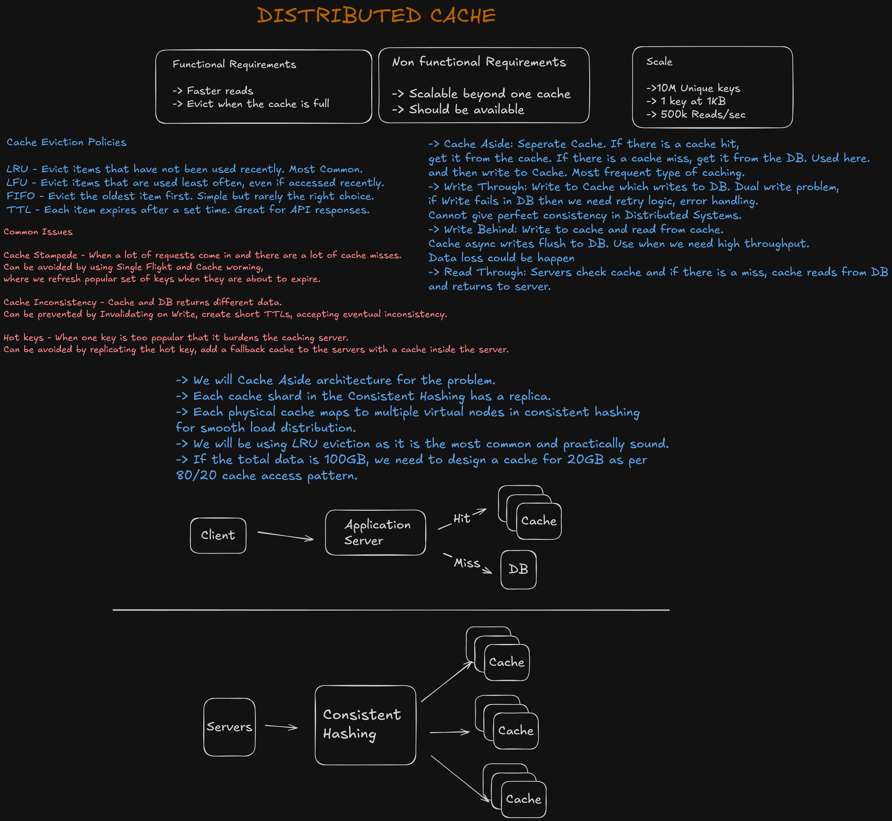
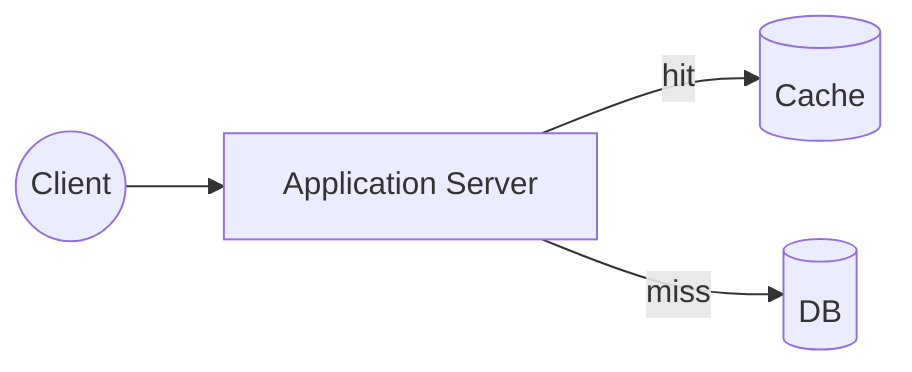
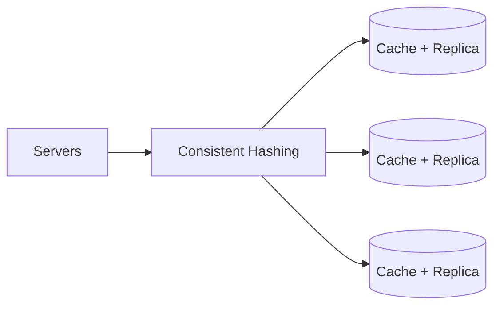

# Distributed Cache

A system design write-up for a distributed cache — a caching layer sitting in front of a database to serve reads faster, sharded across multiple cache nodes so it scales beyond what a single cache instance can hold or serve.

This is a design-only exercise (no implementation code in this folder). The original whiteboard is in [`Distributed_Cache.excalidraw`](./Distributed_Cache.excalidraw); a rendered snapshot is below.

## Requirements

### Functional

- **Faster reads** — serve hot data without hitting the database on every request.
- **Eviction** — when the cache is full, evict entries to make room for new ones.

### Non-functional

- **Scalable beyond one cache** — a single cache instance shouldn't be a ceiling on capacity or throughput.
- **Available** — the cache should stay up and serving traffic.

### Scale

| Metric | Value |
|---|---|
| Unique keys | 10 million |
| Size per key | 1 KB |
| Reads per second | 500,000 |

**Cache sizing:** if the total dataset is 100 GB, the cache doesn't need to hold all of it — following the 80/20 access pattern (80% of reads hit 20% of keys), a cache sized for **~20 GB** covers the hot working set without paying to store the whole dataset in memory.

## Caching Strategies

| Strategy | How it works | Trade-off |
|---|---|---|
| **Cache-Aside** | App checks the cache first; on a hit, return it. On a miss, read from the DB, then write the result into the cache. | **Chosen approach.** Simple and the most common pattern — the cache and DB are decoupled, and a cache outage just means falling back to the DB (slower, but correct). |
| **Write-Through** | Writes go to the cache, which synchronously writes through to the DB. | Has a dual-write problem: if the DB write fails after the cache write succeeds, you need retry/error-handling logic, and distributed systems can't guarantee perfect consistency here. |
| **Write-Behind (write-back)** | Writes go to the cache only; the cache asynchronously flushes to the DB in the background. | Good for high write throughput, but risks **data loss** if the cache crashes before a flush happens. |
| **Read-Through** | The application always reads from the cache; on a miss, the cache itself (not the app) fetches from the DB and populates itself before returning. | Similar to cache-aside but the cache owns the DB-fetch logic instead of the application. |

This design uses **Cache-Aside** for reads, since it's the simplest to reason about and degrades gracefully (a cache failure falls back to the DB rather than breaking reads).

## Cache Eviction Policies

| Policy | How it works | Notes |
|---|---|---|
| **LRU** (Least Recently Used) | Evicts the item that hasn't been accessed in the longest time | **Chosen approach** — most common and practically sound for general-purpose caching |
| **LFU** (Least Frequently Used) | Evicts the item used least often, even if it was accessed recently | Better than LRU when access frequency matters more than recency |
| **FIFO** | Evicts the oldest-inserted item first | Simple, but rarely the right choice since it ignores access patterns entirely |
| **TTL** | Each item expires after a set time, regardless of access pattern | Great for data with a natural freshness window, like API responses |

## High-Level Design

**Read/write path (Cache-Aside):**

- On a request, the application server checks the cache first.
- **Hit:** return the cached value directly — this is the fast path that keeps read latency low.
- **Miss:** read from the DB, then write the result back into the cache so the next request for that key is a hit.

**Sharding (scaling beyond one cache node):**

- **Consistent hashing** distributes keys across multiple cache shards, so the cache layer scales horizontally instead of being capped by one node's memory and throughput.
- Each physical cache node maps to **multiple virtual nodes** on the hash ring, which smooths out load distribution and avoids hotspots that plain consistent hashing (one point per node) can produce.
- **Each cache shard has a replica**, so losing one node doesn't take that shard's data out of service — matching the availability requirement.

## Design Deep Dives

### Cache stampede

A **cache stampede** happens when a burst of requests all miss the cache at once (e.g. a popular key just expired) and all fall through to the DB simultaneously, overwhelming it. Mitigations:

- **Single-flight** — when multiple concurrent requests miss on the same key, only let one of them go to the DB; the rest wait on that in-flight request's result instead of each issuing their own DB call.
- **Cache warming** — proactively refresh popular keys shortly before they expire, so they never actually go cold under load.

### Cache inconsistency

The cache and the DB can drift and return different data for the same key (e.g. after a write updates the DB but not the cache). Mitigations:

- **Invalidate on write** — when the DB is updated, explicitly evict/update the corresponding cache entry instead of letting it go stale.
- **Short TTLs** — bound how long a stale entry can live before it naturally expires and gets refreshed from the DB.
- **Accept eventual inconsistency** — for data where brief staleness is acceptable, it's simpler to tolerate a short inconsistency window than to engineer it away.

### Hot keys

A **hot key** is a single key so popular that the traffic to it overwhelms the one cache node/shard responsible for it — sharding alone doesn't help here, since consistent hashing still routes all requests for that key to the same node. Mitigations:

- **Replicate the hot key** across multiple cache nodes so its read load is spread out instead of concentrated on one.
- **Add a local fallback cache inside each application server** (an in-process cache in front of the distributed cache) so extremely hot keys can be served without even reaching the distributed cache layer.
