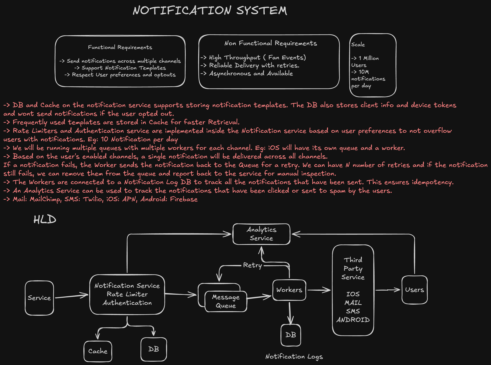
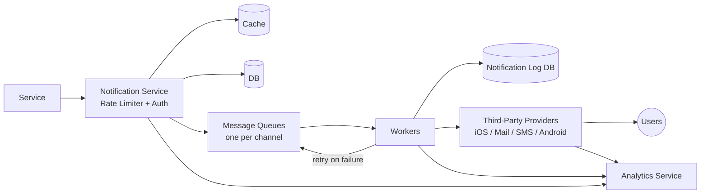

# Notification System

A system design write-up for a multi-channel notification system — a service that lets internal services trigger notifications to users over email, SMS, push (iOS/Android), fanning them out reliably while respecting each user's channel preferences and opt-outs.

This is a design-only exercise (no implementation code in this folder). The original whiteboard is in [`notification_system.excalidraw`](./notification_system.excalidraw); a rendered snapshot is below.

## Requirements

### Functional

- **Send notifications across multiple channels** — email, SMS, iOS push, Android push.
- **Support notification templates** — reusable, parameterized message formats rather than ad-hoc strings per call.
- **Respect user preferences and opt-outs** — never notify a user through a channel they've disabled, or a user who's opted out entirely.

### Non-functional

- **High throughput** — must handle fan-out events (one trigger becoming many per-user, per-channel deliveries).
- **Reliable delivery with retries** — a failed send shouldn't just be dropped.
- **Asynchronous and available** — the caller triggering a notification shouldn't block on it actually being delivered.

### Scale

| Metric | Value |
|---|---|
| Users | 1 million |
| Notifications per day | 10 million |

## High-Level Design

- An upstream **Service** calls into the **Notification Service**, which is the single entry point handling **rate limiting** and **authentication** before anything is queued.
- The Notification Service reads from **DB** (client info, device tokens, channel preferences, opt-outs) and **Cache** (frequently used templates, for fast retrieval instead of hitting the DB on every send).
- Requests fan out into **per-channel message queues**, each with its own pool of **workers** — e.g. iOS has its own queue and worker pool, independent of SMS or email, so one slow/overloaded channel doesn't back up the others.
- Workers hand off to the relevant **third-party provider** per channel, which delivers to the **user**.
- Workers write to a **Notification Log DB** to record what's been sent (see Idempotency below), and both the request path and delivery outcomes feed an **Analytics Service**.

### Third-party providers used per channel

| Channel | Provider |
|---|---|
| Email | MailChimp |
| SMS | Twilio |
| iOS push | APN (Apple Push Notification service) |
| Android push | Firebase (FCM) |

## Design Deep Dives

### Rate limiting and opt-outs

The rate limiter and authentication check live **inside the Notification Service**, before a request is ever queued — so an over-eager caller or a user who's already hit their notification cap (e.g. "10 notifications per day") is rejected up front instead of wasting queue/worker capacity. The same lookup enforces opt-outs: if a user has disabled a channel or opted out entirely, the service simply doesn't enqueue a delivery for that channel.

### Per-channel queues and workers

A single triggered notification can go out over every channel a user has enabled, but each channel gets its **own queue and worker pool** rather than sharing one. This isolates failure and load: if the SMS provider is slow or erroring, its queue backs up without affecting iOS/Android/email delivery, and each channel's throughput can be scaled independently by adding workers to just that queue.

### Retry handling

If a worker's delivery attempt fails, the notification goes back onto its queue for a retry, up to **N attempts** (a natural choice here is exponential backoff between attempts, to avoid hammering an already-struggling third-party provider). If it still fails after N retries, it's pulled off the queue and reported back to the service for **manual inspection** rather than retried forever — effectively a dead-letter pattern.

### Idempotency via the notification log

Workers write every send to a **Notification Log DB**. Before sending (particularly on a retry), a worker can check this log for the notification's dedup key (e.g. `notificationId` + `channel` + `userId`) to confirm it hasn't already been successfully delivered — this is what prevents a retried-but-actually-succeeded notification from being delivered twice to the same user.

### Analytics

A separate **Analytics Service** tracks engagement signals — notifications clicked, marked as spam, delivery success/failure rates — fed by both the request path and the delivery workers. This is what closes the loop for product decisions (e.g. tuning templates or channel mix) separately from the delivery path itself, so analytics collection never adds latency to actual delivery.
