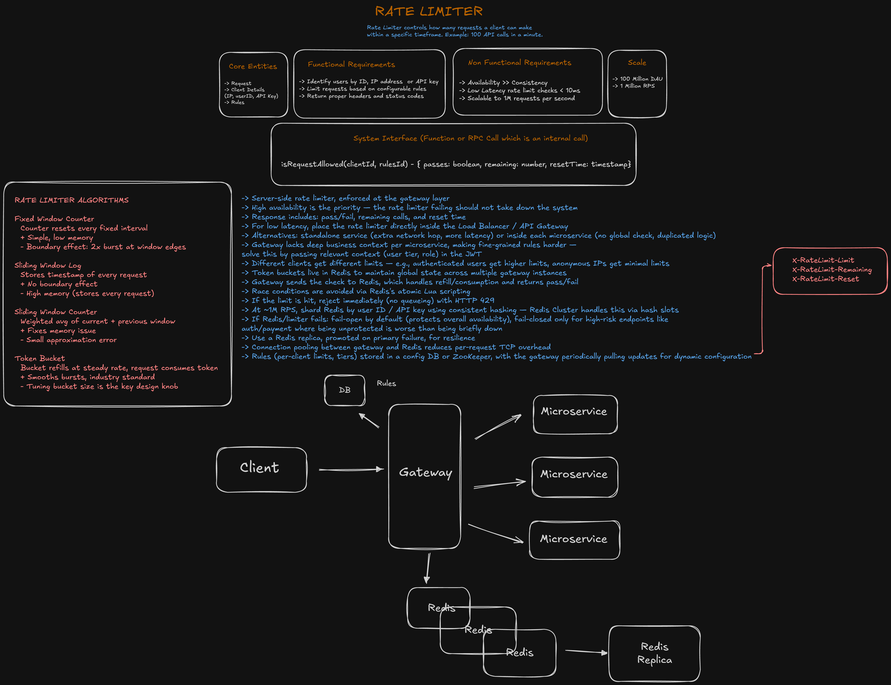
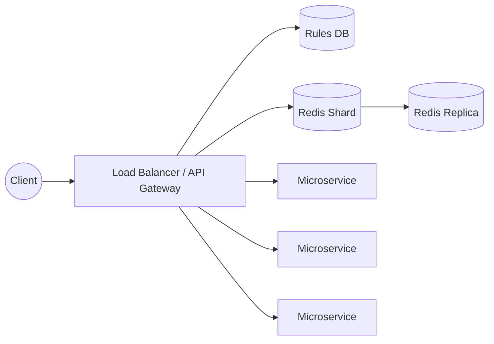

# Rate Limiter

A system design write-up for a server-side rate limiter — a component that controls how many requests a client can make within a specific timeframe (e.g. 100 API calls per minute), enforced at the API gateway layer in front of a set of microservices.

This is a design-only exercise (no implementation code in this folder). The original whiteboard is in [`rate-limiter.excalidraw`](./rate-limiter.excalidraw); a rendered snapshot is below.



## Core Entities

- **Request** — an incoming call to be checked against the limit.
- **Client details** — how a client is identified: IP address, user ID, or API key.
- **Rules** — the configurable limits applied per client (e.g. per tier).

## Requirements

### Functional

- Identify users by ID, IP address, or API key.
- Limit requests based on configurable rules.
- Return proper headers and status codes so clients know their limit, remaining quota, and reset time.

### Non-functional

- **Availability over consistency** — the rate limiter failing should not take down the system it protects.
- **Low latency** — rate limit checks should add well under 10ms.
- **Scalable** — handle up to 1 million requests per second.

### Scale

| Metric | Value |
|---|---|
| Daily active users (DAU) | 100 million |
| Peak requests per second | 1 million |

## System Interface

The rate limiter is exposed as an internal function/RPC call (not a public REST API), typically invoked by the gateway on every incoming request:

```
isRequestAllowed(clientId, rulesId) -> { passes: boolean, remaining: number, resetTime: timestamp }
```

Response headers surfaced back to the client:

```
X-RateLimit-Limit
X-RateLimit-Remaining
X-RateLimit-Reset
```

If the limit is hit, the request is rejected immediately (no queueing) with **HTTP 429 Too Many Requests**.

## Rate Limiting Algorithms

| Algorithm | How it works | Pros | Cons |
|---|---|---|---|
| **Fixed Window Counter** | Counter resets every fixed interval (e.g. every minute) | Simple, low memory | Boundary effect — a client can burst up to 2x the limit across a window edge |
| **Sliding Window Log** | Stores the timestamp of every request | No boundary effect | High memory — stores every request |
| **Sliding Window Counter** | Weighted average of the current and previous window's counts | Fixes the memory issue | Small approximation error |
| **Token Bucket** | A bucket refills at a steady rate; each request consumes a token | Smooths bursts, industry standard | Bucket size is the key tuning knob |

Token Bucket is the algorithm used in the high-level design below, as it's the industry-standard choice for smoothing bursty traffic while still enforcing an average rate.

## High-Level Design



- **Enforced at the gateway layer.** Placing the check in the Load Balancer / API Gateway keeps latency low (one hop) and gives a single, global enforcement point in front of all microservices.
  - Alternatives considered: a **standalone rate-limiting service** (adds an extra network hop and latency) or **embedding the check in each microservice** (no global view of a client's usage, and duplicated logic across services).
  - The gateway's downside is that it lacks deep business context per microservice, which makes fine-grained, service-specific rules harder to apply. This is addressed by passing relevant context (user tier, role) in the JWT so the gateway can apply per-client rules without querying each service.
- **Redis holds the global state.** Token buckets live in Redis so all gateway instances share a consistent view of each client's remaining quota, rather than each instance keeping its own (inconsistent) in-memory counters.
  - The gateway sends the check to Redis, which handles refill/consumption and returns pass/fail.
  - **Race conditions** on concurrent check-and-decrement operations are avoided using Redis's atomic **Lua scripting** (the check and the decrement happen as one atomic operation).
- **Sharding for scale.** At ~1M RPS, Redis is sharded by client ID / API key using consistent hashing; Redis Cluster handles this natively via hash slots.
- **Resilience.** Each Redis shard has a **replica** that can be promoted on primary failure.
- **Connection pooling** between the gateway and Redis reduces per-request TCP connection overhead, which matters at this request volume.
- **Dynamic configuration.** Rules (per-client limits, tiers) are stored in a config DB or ZooKeeper, with the gateway periodically pulling updates — so limits can change without redeploying the gateway.

## Design Deep Dives

### Per-client rules

Different clients get different limits — e.g. authenticated users get higher limits, anonymous requests (identified only by IP) get minimal limits. The client's tier/role is embedded in their JWT so the gateway can look up the right rule without a round trip to a user service.

### Failure mode: fail-open vs. fail-closed

If Redis or the limiter itself becomes unavailable, the default behavior is to **fail open** — let requests through unchecked — because protecting overall system availability takes priority over strict enforcement (matching the availability-over-consistency requirement). **Fail-closed** (reject when the limiter is down) is reserved for high-risk endpoints like authentication or payments, where letting traffic through unprotected is worse than briefly rejecting requests.

### Why Redis specifically

Redis is single-threaded per shard and supports atomic Lua scripting, which makes check-and-decrement operations race-free without needing external locks — a good fit for a high-throughput, low-latency counter workload like this one.
