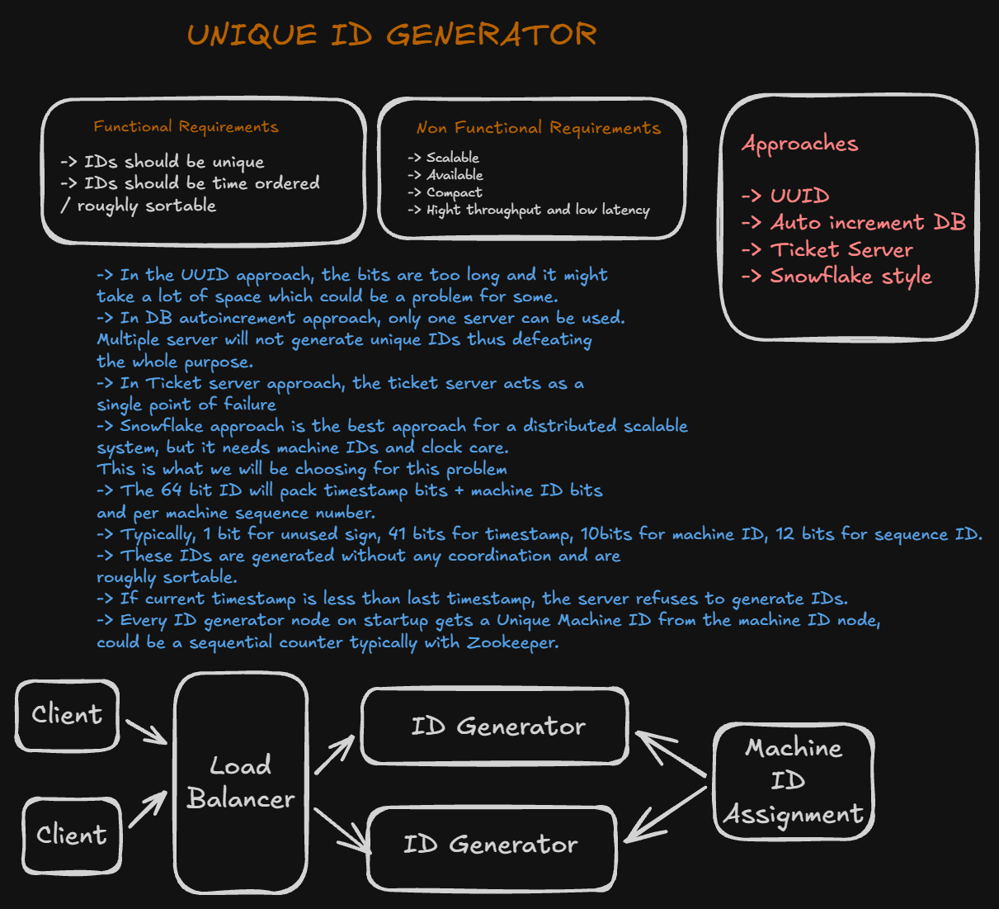
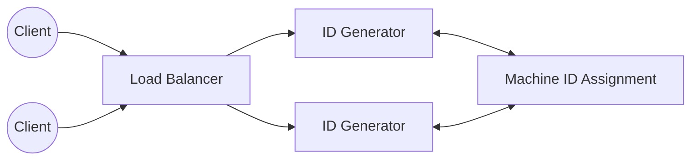

# Unique ID Generator

A system design write-up for a distributed unique ID generator — a service that hands out IDs to be used as primary keys or identifiers across a distributed system, similar to Twitter's Snowflake.

This is a design-only exercise (no implementation code in this folder). The original whiteboard is in [`Unique_ID_Generator.excalidraw`](./Unique_ID_Generator.excalidraw); a rendered snapshot is below.

## Requirements

### Functional

- IDs must be **unique** across the entire distributed system.
- IDs should be **time-ordered** / roughly sortable — an ID generated later should generally be greater than one generated earlier.

### Non-functional

- **Scalable** — many nodes generating IDs concurrently, with no shared bottleneck.
- **Available** — ID generation shouldn't have a single point of failure.
- **Compact** — IDs should be reasonably small to store and index (unlike a 128-bit UUID).
- **High throughput and low latency** — generating an ID should be fast and cheap.

## Approaches Considered

| Approach | How it works | Why it was rejected |
|---|---|---|
| **UUID** | Randomly generated 128-bit identifier, no coordination needed | Too long/wide for some use cases (indexing, storage), and not time-ordered |
| **DB auto-increment** | A single database's `AUTO_INCREMENT` column hands out sequential IDs | Only one server can own the sequence — running multiple servers to generate IDs defeats the purpose of scaling out, since they'd collide or need coordination |
| **Ticket server** | A dedicated server centrally hands out ID ranges/tickets | The ticket server itself becomes a single point of failure and a scaling bottleneck |
| **Snowflake-style** | Each node independently packs a timestamp + machine ID + sequence number into one ID | **Chosen approach** — scales horizontally with no coordination on the hot path, at the cost of needing careful machine-ID assignment and clock handling (see below) |

Snowflake-style generation was chosen as the best fit for a distributed, scalable system: it avoids the single point of failure of the DB and ticket-server approaches while staying far more compact and sortable than plain UUIDs.

## ID Structure (64-bit Snowflake-style ID)

| Bits | Field | Purpose |
|---|---|---|
| 1 | Unused / sign bit | Keeps the ID a positive signed 64-bit integer |
| 41 | Timestamp | Milliseconds since a custom epoch — gives IDs their rough time-ordering |
| 10 | Machine ID | Identifies which node generated the ID, avoiding cross-node collisions |
| 12 | Sequence number | Disambiguates multiple IDs generated by the same node within the same millisecond |

Because the timestamp occupies the highest bits (after the sign bit), IDs generated later are numerically larger than IDs generated earlier — giving rough sortability without any coordination between nodes.

## High-Level Design

- **ID Generator nodes** sit behind a load balancer and generate IDs independently — no coordination is needed between them on the request path, which is what makes this approach horizontally scalable.
- **Machine ID Assignment**: on startup, every ID generator node requests a unique machine ID from a coordination service (e.g. a sequential counter backed by **ZooKeeper**). This is the one coordination point in the system, and it only happens once per node lifecycle (startup), not per request — so it doesn't become a throughput bottleneck.
- Each node then generates IDs locally by combining the current timestamp, its assigned machine ID, and a per-millisecond sequence counter — entirely in-memory, with no network call per ID.

## Design Deep Dives

### Clock care

Since the timestamp is what gives IDs their ordering, a node whose clock moves backward (e.g. after an NTP correction) could generate an ID smaller than one it already issued, breaking the time-ordering guarantee and risking a collision. To guard against this: **if the current timestamp is less than the last timestamp the node used, the node refuses to generate IDs** until its clock catches back up, rather than risking an out-of-order or duplicate ID.

### Sequence number rollover

Within a single millisecond, a node can generate up to 2^12 = 4096 IDs (the sequence number's range) before it must wait for the next millisecond tick. This bounds a single node's throughput to 4096 IDs/ms, which is generally far more than one node needs — additional throughput comes from adding more nodes (more machine IDs), not from widening this field.

### Why machine ID assignment needs coordination, but ID generation doesn't

The one place true coordination is required is making sure no two live nodes ever share a machine ID — that's a small, infrequent operation (once per node startup) best handled by a strongly consistent coordination service like ZooKeeper. Once a node has its machine ID, it never needs to talk to another node or a central service again to generate IDs, which is what keeps the actual ID-generation path fast, available, and coordination-free.
