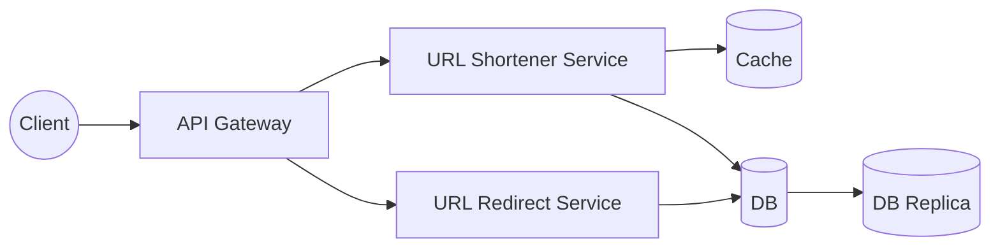

# URL Shortener (Bitly / TinyURL)

A system design write-up for a URL shortening service like Bitly or TinyURL — given a long URL, generate a short alias that redirects to the original when visited.

This is a design-only exercise (no implementation code in this folder). The original whiteboard is in [`URL Shortener.excalidraw`](./URL%20Shortener.excalidraw); a rendered snapshot is below.


## Requirements

### Functional

- **Shorten URL** — convert a long URL into a short URL.
- **Redirect** — visiting the short URL redirects to the original long URL.
- **URL expiration** — a short URL should expire after a period of time.
- **Analytics** — track click counts per short URL.

### Non-functional

- **High availability** — the service (especially redirection) should be available at all times; a shortened link should always work.
- **Security** — prevent malicious content and phishing via shortened links.
- **Scalability** — handle a large and growing volume of URLs.
- **Performance** — minimal latency between clicking a short URL and being redirected.

**Key trade-off:** favor **availability over consistency** (CAP). A redirect should always succeed even if, say, the click-count analytics is briefly stale or a replica is slightly behind.

## Capacity Estimation

| Metric | Value |
|---|---|
| Daily active users (DAU) | 100 million |
| Reads (redirects) per day | 1 billion |
| Reads per second (avg) | ~10,000 |
| Total lifetime URLs | 5 billion |
| Short URL length | 6 characters |
| Alphabet | `a-z`, `A-Z`, `0-9` (62 characters) |
| Address space at 6 chars | 62^6 ≈ 56 billion possible short URLs |

56 billion possible codes comfortably covers 5 billion lifetime URLs, leaving headroom for growth.

**Storage:** a `shortURL` + `longURL` record is roughly ~1 KB. At 5 billion records, that's ~5 TB total — well within what a single well-provisioned relational database (with a replica) can hold, so horizontal sharding isn't required at this scale.

## API Design

**Shorten a URL**
```
POST /api/urls/shorten
Request:  { "longUrl": "https://example.com/very/long/path" }
Response: { "shortUrl": "https://short.ly/aZ3x9K" }
```

**Redirect**
```
GET /api/urls/{shortUrl}
Response: 302 Found -> Location: <longUrl>
```
A `302` (temporary) redirect is used rather than `301` (permanent) so that every click still passes through the redirect service — this is what enables click analytics and lets a URL be disabled/expired later. If analytics weren't a requirement, browsers/CDNs could cache a `301` and reduce load further.

## Data Model

A single table is enough at this scale:

**`ShortUrl`**

| Field | Type | Notes |
|---|---|---|
| `id` | string | internal identifier |
| `shortUrl` | string | the 6-character code, indexed/unique |
| `longUrl` | string | the original URL |
| `createdAt` | date | used to compute expiration |
| `countClicks` | int | running click count, updated by the analytics flow |

## High-Level Design



- **Decoupled services:** shortening and redirection could live in one service, but splitting them lets each be scaled and deployed independently — redirects are read-heavy and latency-sensitive (10K/s), while shortening is comparatively low-volume write traffic.
- **API Gateway** sits in front of both services and routes requests, so the client only ever talks to one endpoint and doesn't need to know how the backend is decomposed.
- **Cache** sits in front of the DB on the read path to absorb the heavy, skewed redirect traffic (popular links get clicked far more than average) and keep redirect latency low.
- **DB Replica** provides read scaling and failover: if the primary goes down, the replica can be promoted to primary to preserve availability (matching the "availability over consistency" choice above).

## Design Deep Dives

### Generating the short code

Two common approaches were considered:

1. **Hashing** — hash the long URL (e.g. MD5/SHA) and take the first 6 characters (base62-encoded). Collisions are handled by retrying (e.g. append a salt and re-hash). At this scale, collisions are rare enough that retries add negligible latency — generating a unique short URL should still complete in well under 5 seconds even under contention.
2. **Counter / range-handout service** — a centralized counter (e.g. backed by **Redis**, which is single-threaded and therefore naturally avoids race conditions on the increment) hands out unique IDs that are then base62-encoded into the short code. This guarantees no collisions but introduces a **single point of failure** and a shared bottleneck, so it needs its own HA story (e.g. clustering, or handing out pre-reserved ID ranges to each server instead of one ID per request).

The diagram favors the hashing + retry approach for simplicity, with the counter service noted as an alternative worth calling out along with its trade-off.

### Read scaling / caching

Redirects are the dominant traffic pattern (10K reads/sec vs. relatively infrequent writes), and traffic is skewed toward popular links. Caching frequently-accessed `shortUrl -> longUrl` mappings (e.g. in Redis, LRU eviction) cuts DB load and keeps redirect latency low. The `GET /api/urls/{shortUrl}` response can also be cached at the HTTP layer when click analytics aren't required for that request.

### Click analytics

Two options, in increasing order of scalability:

- **Synchronous increment:** the redirect service increments `countClicks` in the DB on every redirect. Simple, but adds a write on the hot read path and doesn't scale well at 10K/s.
- **Buffered/async counting:** a separate analytics service accumulates counts in memory (or a fast store) and periodically flushes aggregated counts back to the DB via a background/cron job. This keeps the redirect path fast and turns many small writes into few batched ones.

### Expiration

- On every read, compare the current time against `createdAt` (plus the configured TTL); if expired, don't redirect (return 404/410 instead).
- A background worker periodically sweeps and deletes expired records from the DB, so storage doesn't grow unbounded with dead links. (The exact TTL is a product decision — call it out as a clarifying question in an interview rather than assuming a value.)

### Security

Malicious/phishing links are a real risk for any open URL shortener. At creation time, check the submitted long URL against a safe-browsing/blocklist API (e.g. Google Safe Browsing) and reject or flag known-malicious domains before a short link is ever issued.

### Availability

The DB has a **replica** that can be promoted to primary if the main DB goes down, so redirects (the availability-critical path) keep working even during a primary failure — consistent with the "availability over consistency" trade-off chosen up front.
